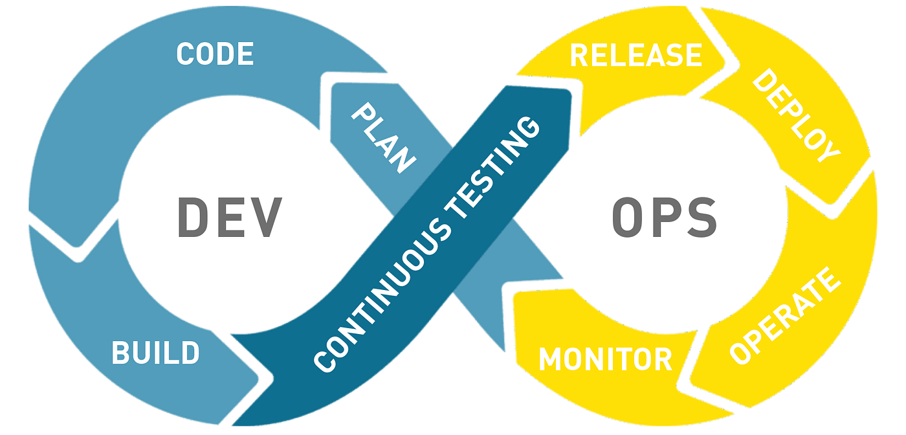

# CI/CD: Continuous Integration and Continuous Deployment

- [CI/CD: Continuous Integration and Continuous Deployment](#cicd-continuous-integration-and-continuous-deployment)
  - [Integración continua a nivel local](#integración-continua-a-nivel-local)
    - [Análisis estático de código: ESLint y Prettier](#análisis-estático-de-código-eslint-y-prettier)
    - [Instalación y configuración de Prettier](#instalación-y-configuración-de-prettier)
    - [Instalación y configuración de ESLint](#instalación-y-configuración-de-eslint)
    - [Git Hooks](#git-hooks)
      - [Husky](#husky)
    - [Instalación y configuración de Husky](#instalación-y-configuración-de-husky)
    - [Ejemplos de scrips para Husky](#ejemplos-de-scrips-para-husky)
  - [Herramientas de CI/CD a nivel servidor](#herramientas-de-cicd-a-nivel-servidor)
  - [CI/CD en GitHub. GitHub Actions](#cicd-en-github-github-actions)
    - [Ejemplo existente en GitHub](#ejemplo-existente-en-github)
    - [Ejemplo de configuración de CI/CD con GitHub Actions](#ejemplo-de-configuración-de-cicd-con-github-actions)
    - [Automatización de una release con GitHub Actions](#automatización-de-una-release-con-github-actions)
    - [CD: Despliegue de Astro en Git](#cd-despliegue-de-astro-en-git)
    - [CD: Despliegue continuo en Vercel](#cd-despliegue-continuo-en-vercel)
    - [CD: Despliegue continuo en Azure](#cd-despliegue-continuo-en-azure)
    - [Ejercicios](#ejercicios)
    - [Referencias](#referencias)
  - [CI/CD en GitLab. GitHub Pipelines](#cicd-en-gitlab-github-pipelines)
    - [Configuración de un pipeline](#configuración-de-un-pipeline)
    - [Artefactos y dependencias entre jobs](#artefactos-y-dependencias-entre-jobs)
    - [Test values and variables](#test-values-and-variables)
    - [Prepare deployment](#prepare-deployment)
    - [Despliegue automático](#despliegue-automático)
    - [Gestión de variables y secretos](#gestión-de-variables-y-secretos)
    - [Buenas prácticas en CI/CD en GitLLab](#buenas-prácticas-en-cicd-en-gitllab)

La **integración continua** (CI) y la **entrega/despliegue continuo** (CD) son prácticas de desarrollo de software que permiten automatizar la **construcción**, las **pruebas** y el **despliegue a producción** de aplicaciones de forma rápida y segura. Estas prácticas permiten a los equipos de desarrollo y operaciones colaborar de manera más eficiente y entregar software de alta calidad de forma más rápida y predecible.

- Integración: ejecución automática de pruebas al hacer cambios en el código.
- Entrega/Despliegue: envío del código validado a producción u otros entornos sin intervención manual.

Los servicios de CI/CD salvan las distancias entre las actividades y los equipos de desarrollo y operación, al imponer la automatización en la construcción, las pruebas y el despliegue de las aplicaciones, en el marco de los procesos conocidos como DevOps.

La **integración continua** (CI) es una práctica de desarrollo de software en la que los miembros de un equipo integran su trabajo con frecuencia en un repositorio, incluso varias veces al día. Cada integración se verifica mediante la **construcción automatizada** y las **pruebas unitarias**, lo que permite detectar errores rápidamente y corregirlos antes de que se conviertan en problemas mayores.

Una primera etapa de este proceso puede tener lugar a **nivel local**, en el equipo de cada desarrollador, vinculado al proceso de creación de los commits. En este caso, se pueden utilizar herramientas como **Husky** para ejecutar pruebas unitarias y de estilo de código antes de realizar un commit, o **Lint-staged** para ejecutar pruebas de estilo de código en los archivos que se han modificado.

Los estilos de código, generalmente aceptados por la comunidad o consensuados a nivel de equipo, pueden quedar
definidos en archivos de configuración como `.eslintrc` o `.prettierrc`, y pueden ser verificados automáticamente con herramientas como **ESLint** o **Prettier**. Aunque estas herramientas disponen de plugins que permiten su integración en el IDE (por ejemplo, **VSCode**), también pueden ser configuradas para que se ejecuten automáticamente en cada commit, o en un paso previo a la integración continua, por ejemplo utilizando Husky.

Una vez que el código ha sido integrado en el repositorio, se puede proceder a la **integración continua** propiamente dicha, a **nivel del servidor de integración continua**. En este servidor, se ejecutan las pruebas de integración, las pruebas de regresión y las pruebas de aceptación, y se generan los artefactos de construcción que se utilizarán en el despliegue a producción.

La **entrega continua** (CD) es una extensión de la integración continua que automatiza el despliegue de software en entornos de prueba y producción. Con la entrega continua, cada cambio en el código se despliega automáticamente en un entorno de prueba, donde se ejecutan pruebas automatizadas para verificar su funcionamiento. Si las pruebas son exitosas, el cambio se despliega automáticamente en producción, lo que permite a los equipos de desarrollo entregar software de alta calidad de forma rápida y segura.



## Integración continua a nivel local

### Análisis estático de código: ESLint y Prettier

Un primer nivel de análisis y corrección de errores en el código fuente se puede realizar a nivel local, en el equipo de cada desarrollador, utilizando herramientas como [**ESLint**](https://eslint.org/) y [**Prettier**](https://prettier.io/).

**Prettier** es una herramienta de formateo de código para JavaScript que permite aplicar un estilo de código consistente y legible en todo el proyecto. Se define a si misma como "opinionated code formatter". es decir un formateador de código con opiniones, que se basa en una serie de reglas predefinidas y que no recomienda la personalización de las mismas, aunque si lo permite.

**ESLint** es un "linter" de código, una herramienta de análisis estático de código para JavaScript que permite identificar y corregir errores de sintaxis, errores de estilo y errores de lógica en el código fuente. Podría entenderse como un paso más allá de Prettier, y también permite la personalización de las reglas de estilo y la definición de reglas de calidad de código.

Prettier y ESLint disponen de plugins que facilitan su integración en el IDE (por ejemplo, VSCode), se pueden ejecutar desde linea de comandos y también pueden ser configurados para que se ejecuten automáticamente en cada commit, o en un paso previo a la integración continua, por ejemplo utilizando Husky.

### Instalación y configuración de Prettier

Para instalar Prettier en un proyecto, se pueden ejecutar los siguientes comandos:

```sh
npm install -D prettier
```

Para configurar Prettier, se puede crear un archivo de configuración `.prettierrc` en el directorio raíz del proyecto, que contiene la configuración de Prettier para el proyecto.

Como en otros casos casos, el fichero de configuración pueden sustituirse por configuraciones añadidas en el archivo `package.json` del proyecto, en la sección `prettier`.

Por ejemplo, para modificar los valores por defecto de Prettier para que formatee el código de JS/TS utilizando comillas simples y sin punto y coma al final de las líneas, se puede añadir la siguiente configuración en el archivo `package.json`:

```json
// package.json
  "prettier": {
    "singleQuote": true,
    "semi": false
  }
```

### Instalación y configuración de ESLint

A la hora de utilizar ESLint en un proyecto, hay que tener en cuenta los cambios introducidos en la versión 9.x, que han simplificado la instalación y configuración de ESLint en un proyecto, pero provocando serios problemas de retrocompatibilidad con las versiones anteriores.

Hasta la versión 9, para instalar ESLint en un proyecto, se solía ejecutar el siguiente comando:

```sh
npm install -D eslint
```

A continuación, se puede configurar ESLint ejecutando el siguiente comando:

```sh
npx eslint --init
```

Las nuevas versiones 9.x proporciona un comando que combina la instalación y la configuración en un solo paso, por lo que se puede ejecutar el siguiente comando:

```sh
npm init @eslint/config@latest
```

En cualquiera de los dos casos la configuración se hace mediante un asistente que permite seleccionar las características de ESLint en el proyecto. En las versiones previas a la 9.x esto incluía el conjunto de reglas de estilo, mientras que en las versiones 9.x se selecciona un conjunto de reglas predefinidas, como `pluginJs.configs.recommended`.

Como consecuencia se crea un archivo de configuración `.eslintrc` o `eslint.config.mjs` en el directorio raíz del proyecto, que contiene la configuración de ESLint para el proyecto.

Si se utilizan ambos, Prettier y ESLint, en un proyecto, es recomendable instalar el plugin `eslint-config-prettier` y añadirlo a la configuración de ESLint, para que ESLint no aplique reglas que entren en conflicto con Prettier.

```sh
npm install -D eslint-config-prettier
```

En ESLInt previo a la versión 9.x, se añade a la configuración de ESLint en el archivo `.eslintrc`, como último de los extends:

```json
// .eslintrc
{
  "extends": ["eslint:recommended", "prettier"]
}
```

En ESLint versión 9.x, se añade a la configuración de ESLint en el archivo `eslint.config.mjs`, también en último lugar:

```js
// .eslint.config.js
export default [
  { languageOptions: { globals: { ...globals.browser, ...globals.node } } },
  pluginJs.configs.recommended,
  eslintConfigPrettier,
];
```

### Git Hooks

Los hooks son scripts que se ejecutan automáticamente en determinados momentos del ciclo de vida de un repositorio Git. Permiten automatizar tareas, como la validación de código, la ejecución de tests, el envío de notificaciones, etc.

Podemos encontrar información sobre su funcionamiento

- en la documentación oficial de Git: https://git-scm.com/book/en/v2/Customizing-Git-Git-Hooks
- el el libro Pro Git: https://git-scm.com/book/en/v2/Customizing-Git-Git-Hooks

Al inicializar un nuevo repositorio con `git init`, Git llena el directorio de hooks `.git/hooks` con varios scripts de ejemplo, muchos de los cuales son útiles por sí mismos; además, documentan los valores de entrada de cada script. Todos los ejemplos están escritos como `scripts de shell`, con algo de `Perl`, pero cualquier script ejecutable con un nombre correcto funcionará correctamente; (`Ruby`, `Python`...). Si quieres usar los scripts de hook incluidos, tendrás que renombrarlos; todos sus nombres de archivo terminan en .sample.

Los hooks que se encuentran inicialmente en el directorio `.git/hooks` del repositorio son los siguientes:

- prepare-commit-msg.sample -> Preparar el mensaje de commit
- commit-msg.sample -> Validar el mensaje de commit
- pre-commit.sample -> Validar los cambios antes de hacer un commit
- push-to-checkout.sample -> Validar los cambios antes de hacer un checkout
- pre-merge-commit.sample -> Validar los cambios antes de hacer un merge
- pre-rebase.sample -> Validar los cambios antes de hacer un rebase
- pre-push.sample -> Validar los cambios antes de hacer un push
- pre-receive.sample -> Validar los cambios antes de recibir un push

- update.sample -> Validar los cambios antes de hacer un update
- post-update.sample -> Notificar a los usuarios sobre actualizaciones
- applypatch-msg.sample -> Validar los mensajes de los parches aplicados
- pre-applypatch.sample -> Validar los parches antes de aplicarlos
- fsmonitor-watchman.sample -> Integración con Watchman para mejorar el rendimiento de git status
- sendemail-validate.sample -> Validar los correos electrónicos enviados

Estos hooks se pueden clasificar en dos tipos:

- hooks de lado cliente: commits, emails, rebase, ...
- hooks de lado servidor: prereceive, postreceive, update

Los hooks de lado cliente se ejecutan en el equipo del desarrollador y permiten validar los cambios antes de hacer un commit, un push, un rebase, etc.
Los hooks de lado servidor se ejecutan en el servidor y permiten validar los cambios antes de recibir un push, notificar a los usuarios sobre actualizaciones, etc.

#### Husky

[Husky](https://typicode.github.io/husky/) es una herramienta que permite ejecutar scripts de cualquier lenguaje de scripting (por ejemplo Node.js) en respuesta a eventos de Git. Para ello se aprovechan los [**hooks** de Git](https://git-scm.com/book/en/v2/Customizing-Git-Git-Hooks), que son scripts que en función de su nombre, se ejecutan automáticamente en respuesta a eventos específicos, como `pre-commit`, `prepare-commit-msg`, `commit-msg` y `post-merge`.

Husky puede utilizarse para ejecutar pruebas unitarias y de estilo de código antes de realizar un commit, o para ejecutar pruebas de estilo de código en los archivos que se han modificado.

### Instalación y configuración de Husky

Para instalar Husky en un proyecto, se puede ejecutar el siguiente comando:

```sh
npm install -D husky
```

A continuación, se puede configurar Husky ejecutando el siguiente comando:

```sh
npx husky init
```

Como consecuencia de crea un script `pre-commit` y se añade o se actualiza en el archivo `package.json` el script `prepare`:

```json
// package.json
  "scripts": {
    "test": "node --test",
    "prepare": "husky"
  }
```

```script
// .husky/pre-commit
npm test
```

En este caso, el script `pre-commit` ejecuta el script `test` definido en el archivo `package.json`.
El valor por defecto de ese script, en lugar de ejecutar las pruebas unitarias, incluye un mensaje y un código de salida.

```json
// package.json
  "scripts": {
    "test": "echo \"Error: no test specified\" && exit 1"
  }
```

Si el código de salida es 1, estamos simulando un error en las pruebas unitarias, lo que provocará que Husky impida que el commit se realice. De esta forma podemos comp`robar fácilmente el correcto funcionamiento de Husky.

### Ejemplos de scrips para Husky

Para el hook commit-msg, podemos forzar que el mensaje del commit tenga una longitud entre 10 y 72 caracteres, mediante el siguiente script:

```sh
// .husky/commit-msg
#!/bin/sh
. "$(dirname "$0")/_/husky.sh"

while read line; do
    # Skip comments
    if [ "${line:0:1}" == "#" ]; then
        continue
    fi
    if [ ${#line} -ge 72 ] || [ ${#line} -le 10 ]; then
        echo -e "\033[0;31mThe length of the message has to be between 10 and 72 characters."
        exit 1
    fi
done < "${1}"

exit 0
```

Para el hook pre-commit, podemos forzar que se ejecute un script de linting antes de cada commit, mediante el siguiente script:

```sh
// .husky/pre-commit
npm run lint
```

Para el hook pre-push, podemos forzar que el nombre de la rama cumpla con un patrón específico, mediante el siguiente script:

```sh
#!/bin/sh
. "$(dirname "$0")/_/husky.sh"

local_branch_name="$(git rev-parse --abbrev-ref HEAD)"

valid_branch_regex='^((hotfix|bugfix|feature)\/[a-zA-Z0-9\-]+)$'

message="Please check your branch name."

if [[ ! $local_branch_name =~ $valid_branch_regex ]]; then
    echo -e "\033[0;31m$message"
    exit 1
fi

exit 0
```

Para el hook post-merge, podemos forzar que se ejecute un script específico después de cada merge, mediante el siguiente script:

```sh
#!/bin/sh
. "$(dirname "$0")/_/husky.sh"

npm run post-merge
```

En el ejemplo del pre-push, al comprueba que el nombre de la rama cumpla con un patrón específico, indirectamente estamos protegiendo la rama `main` o `master` de cambios directos, ya que el nombre de la rama no cumplirá con el patrón. Los cambios en estas rama quedarían restringidos al uso de **pull requests (PR)**, que permiten revisar los cambios antes de integrarlos en la rama principal.

Sin embargo tenemos que tener en cuenta que los hooks de Git son scripts que se ejecutan en el equipo de cada desarrollador, por lo que pueden ser modificados por los desarrolladores o deshabilitados añadiendo a la ejecución de los comandos de git el modificador `--no-verify`.

Además, nada garantiza que los hooks de Git se compartan en todos los miembros del equipo. Por todo ello, Husky no es una solución definitiva para garantizar la calidad del código. Para ello, es necesario implementar un sistema de integración continua y entrega continua a nivel del servidor de integración continua.

## Herramientas de CI/CD a nivel servidor

Existen muchas herramientas que permiten implementar un servidor CI/CD en un proyecto, algunas de las más populares son:

- **Jenkins**: Es una herramienta de automatización de código abierto que permite a los equipos de desarrollo automatizar la construcción, las pruebas y el despliegue de aplicaciones.
- **Travis CI**: Es un servicio de integración continua basado en la nube que permite a los equipos de desarrollo automatizar la construcción, las pruebas y el despliegue de aplicaciones.
- **CircleCI**: Es un servicio de integración continua basado en la nube que permite a los equipos de desarrollo automatizar la construcción, las pruebas y el despliegue de aplicaciones.

Otros servicios de CI/CD vinculados a plataformas concretas de hosting de repositorios y aplicaciones son:

- **GitHub Actions**: Es un servicio de integración continua basado en la nube que permite a los equipos de desarrollo automatizar la construcción, las pruebas y el despliegue de aplicaciones directamente desde GitHub.
- **GitLab CI/CD**: Es un servicio de integración continua basado en la nube que permite a los equipos de desarrollo automatizar la construcción, las pruebas y el despliegue de aplicaciones directamente desde GitLab.
- **AWS CodePipeline**: Es un servicio de integración continua basado en la nube que permite a los equipos de desarrollo automatizar la construcción, las pruebas y el despliegue de aplicaciones en AWS.
- **Azure DevOps**: Es un servicio de integración continua basado en la nube que permite a los equipos de desarrollo automatizar la construcción, las pruebas y el despliegue de aplicaciones en Azure.
- **Google Cloud Build**: Es un servicio de integración continua basado en la nube que permite a los equipos de desarrollo automatizar la construcción, las pruebas y el despliegue de aplicaciones en Google Cloud.
- **Bamboo**: Es una herramienta de integración continua y entrega continua de Atlassian que permite a los equipos de desarrollo automatizar la construcción, las pruebas y el despliegue de aplicaciones.

En definitiva, todas estas herramientas lo que proporcionan es un entorno virtualizado () en el que se ejecutan los scripts de construcción, pruebas y despliegue de la aplicación, y que se configura para que se ejecute automáticamente en respuesta a eventos específicos, como la integración de código en un repositorio o la creación de una solicitud de extracción.

## CI/CD en GitHub. GitHub Actions

[GitHub Actions](https://docs.github.com/es/actions) es un servicio de integración continua basado en la nube que permite a los equipos de desarrollo automatizar la construcción, las pruebas y el despliegue de aplicaciones directamente desde GitHub. GitHub Actions se basa en el uso de **workflows**, que son archivos de configuración que definen las acciones que se deben ejecutar en respuesta a eventos específicos, como la integración de código en un repositorio o la creación de una solicitud de extracción.

Estos workflows se definen en archivos YAML que se almacenan en el directorio `.github/workflows` del repositorio, y se pueden configurar para que se ejecuten automáticamente en respuesta a eventos específicos, como la integración de código en un repositorio o la creación de una solicitud de extracción. El formato YAML es un formato de serialización de datos que es fácil de leer y escribir para los humanos, y que es fácil de procesar para las máquinas. Se basa en la indentación y en la estructura de clave-valor, y se utiliza en muchos lenguajes de programación y herramientas de configuración. Es muy recomendable algún plugin de VSCode para YAML, preferiblemente la creada por RedHat, considerada en la práctica como la extensión oficial.

Los elementos básicos de un workflow de GitHub Actions son:

- **Name**: El nombre del workflow.
- **On**: El evento que desencadena el workflow (por ejemplo pull_request, push) y en que rama (generalmente main o master).
- **Jobs**: Los trabajos que se deben ejecutar en el workflow.

Cada trabajo puede contener los siguientes elementos:

- **Name**: El nombre del trabajo.
- **Runs-on**: El sistema operativo en el que se debe ejecutar el trabajo (por ejemplo ubuntu-latest).
- **Steps**: Los pasos que se deben ejecutar en el trabajo.

Por su parte los steps pueden contener los siguientes elementos:

- **Name**: El nombre del paso (opcional).
- **Run**: El comando que se debe ejecutar en el paso.
- **Uses**: La acción pre-configurada que se debe ejecutar en el paso.

Las acciones se pueden componer de otras acciones y GitHub tiene un marketplace con muchas acciones pre-configuradas que se pueden utilizar en los workflows.

Generalmente una de las primeras acciones que se ejecutan en un workflow es la de checkout, que permite clonar el repositorio en el que se está ejecutando el workflow.
Para ello disponemos de la acción `actions/checkout@v4` que podemos localizar en el marketplace como un repositorio de GitHub [actions/checkout](https://github.com/actions/checkout) con el código de la propia acción y la documentación sobre su uso.

El siguiente paso es muchas veces instalar una versión concreta de Node.js, para lo cual disponemos de la acción `actions/setup-node@v4` que podemos localizar en el marketplace como un repositorio de GitHub [actions/setup-node](https://github.com/actions/setup-node). En este caso la versión de Node la guardamos como una variable de entorno en el archivo de configuración del workflow, mediante la strategy matrix.

### Ejemplo existente en GitHub

Al hacer click en el botón **New workflow** en la sección **Actions** de un repositorio de GitHub, se nos muestra una lista de ejemplos de workflows pre-configurados que podemos utilizar en nuestro proyecto.

En el apartado de **Automation** se incluye un ejemplo llamado **Greetings** que se puede utilizar para enviar un mensaje de saludo cuando se crea un nuevo issue en el repositorio.

Su estructura es muy simple:

```yaml
name: Greetings

on: [pull_request_target, issues]

jobs:
  greeting:
    runs-on: ubuntu-latest
    permissions:
      issues: write
      pull-requests: write
    steps:
      - uses: actions/first-interaction@v1
        with:
          repo-token: ${{ secrets.GITHUB_TOKEN }}
          issue-message: "Message that will be displayed on users' first issue"
          pr-message: "Message that will be displayed on users' first pull request"
```

Es fácil configurarla con los mensajes adecuados e incorporarla a nuestro proyecto.

### Ejemplo de configuración de CI/CD con GitHub Actions

A continuación se muestra un ejemplo de configuración de CI/CD con GitHub Actions para un proyecto de Node.js.
Después de las etapas ya indicadas de checkout y setup de Node.js

- se instalan las dependencias del proyecto con `npm ci`
- se ejecuta el script de npm responsable de las pruebas de estilo de código con `npm run lint`.
- se ejecutan el script de npm responsable las pruebas unitarias con su coverage con `npm test`

Evidentemente se da por hecho que existen los scripts `lint` y `test` en el archivo `package.json` del proyecto y que su funcionamiento es correcto en el entorno local.

```yaml
name: Node.js CI

on:
  push:
    branches:
      - main
  pull_request:
    branches:
      - main

jobs:
  build:
    runs-on: ubuntu-latest

    strategy:
      matrix:
        node-version: [14.x]

    steps:
      - name: Checkout
        uses: actions/checkout@v4

      - name: Use Node.js ${{ matrix.node-version }}
        uses: actions/setup-node@v4
        with:
          node-version: ${{ matrix.node-version }}

      - name: Install dependencies
        run: npm ci

      - name: Lint
        run: npm run lint

      - name: Test with coverage
        run: npm test
```

Cada etapa del workflow puede terminar con un código de salida 0, indicando que la etapa se ha ejecutado correctamente, o con un código de salida distinto de 0, generalmente 1, indicando que la etapa ha fallado. En caso de que una etapa falle, el workflow se detiene y se muestra un mensaje de error en la interfaz de GitHub Actions, al tiempo que se impide el proceso que disparo el evento, por ejemplo un push o una pull request.

Los scripts de package.json pueden ser tan simples como:

```json
"scripts": {
  "lint": "eslint .",
  "test": "jest --coverage"
}
```

Es importante que no incluyan comandos interactivos, ya que los workflows de GitHub Actions se ejecutan en un entorno virtualizado y no permiten la interacción con la consola. De la misma forma hay que evitar modificadores de tipo `--watch` que harían que el script no termine nunca.

### Automatización de una release con GitHub Actions

```yaml
# .github/workflows/release.yml
name: Create Release

on:
  push:
    tags:
      - "v*"

jobs:
  release:
    runs-on: ubuntu-latest
    steps:
      - uses: actions/checkout@v3

      - name: Build project
        run: |
          npm ci
          npm run build

      - name: Create Release
        uses: actions/create-release@v1
        env:
          GITHUB_TOKEN: ${{ secrets.GITHUB_TOKEN }}
        with:
          tag_name: ${{ github.ref }}
          release_name: Release ${{ github.ref }}
          draft: false
          prerelease: false
          body: |
            ## Changes
            - Auto-generated release from tag ${{ github.ref }}
```

### CD: Despliegue de Astro en Git

```yaml
name: Deploy Astro Site
# Trigger the workflow every time you push to the `main` branch
# Using a different branch name? Replace `main` with your branch’s name
on:
  push:
    branches:
      - main

# Allows you to run this workflow manually from the Actions tab on GitHub.
workflow_dispatch:

# Allow this job to clone the repo and create a page deployment
permissions:
  contents: read
  pages: write
  id-token: write

jobs:
  build-and-deploy:
    runs-on: ubuntu-latest
    steps:
      - name: Checkout repository
        uses: actions/checkout@v4

      - name: Setup Node.js
        uses: actions/setup-node@v4
        with:
          node-version: "20"

      - name: Install, build, and upload your site
        uses: withastro/action@v3

      # - name: Install dependencies
      #   run: npm ci

      # - name: Build Astro site
      #   run: npm run build

  deploy:
    needs: build
    runs-on: ubuntu-latest
    environment:
      name: github-pages
      url: ${{ steps.deployment.outputs.page_url }}
    steps:
      - name: Deploy to GitHub Pages
        id: deployment
        uses: actions/deploy-pages@v4
```

### CD: Despliegue continuo en Vercel

La etapa correspondiente a la **entrega continua** (CD) es responsable de automatizar el despliegue de software en entornos de prueba y producción y también se puede implementar con una step de las GitHub Actions.

Su contenido exacto dependerá del destino de el despliegue. Cuando se trata de empresas que proporcionan servicios de hosting, como Render, Netlify, Vercel, AWS, Azure, Google Cloud, etc., suelen proporcionar acciones pre-configuradas que se pueden utilizar en los workflows de GitHub Actions.

Por ejemplo, para el caso de [Vercel](https://vercel.com/guides/how-can-i-use-github-actions-with-vercel), se puede utilizar el siguiente código en el workflow de GitHub Actions:

```yaml
name: Vercel Preview Deployment
env:
  VERCEL_ORG_ID: ${{ secrets.VERCEL_ORG_ID }}
  VERCEL_PROJECT_ID: ${{ secrets.VERCEL_PROJECT_ID }}
on:
  push:
    branches-ignore:
      - main
jobs:
  Deploy-Preview:
    runs-on: ubuntu-latest
    steps:
      - uses: actions/checkout@v2
      - name: Install Vercel CLI
        run: npm install --global vercel@latest
      - name: Pull Vercel Environment Information
        run: vercel pull --yes --environment=preview --token=${{ secrets.VERCEL_TOKEN }}
      - name: Build Project Artifacts
        run: vercel build --token=${{ secrets.VERCEL_TOKEN }}
      - name: Deploy Project Artifacts to Vercel
        run: vercel deploy --prebuilt --token=${{ secrets.VERCEL_TOKEN }}
```

Los **secrets** que aparecen en el código del workflow de GitHub Actions los proporcionas nuestra cuenta de Vercel y se definen en la interfaz de GitHub Actions, en la sección de configuración del repositorio, y se utilizan para almacenar información sensible, como tokens de acceso a servicios de hosting.

Otra posibilidad es desplegar en un servidor propio, para lo cual se puede utilizar la acción `appleboy/ssh-action@master` , basada en el uso de SSH y que se puede localizar en el marketplace como un repositorio de GitHub [appleboy/ssh-action](https://github.com/appleboy/ssh-action).

Finalmente, en los servidores comerciales que antes hemos mencionado suele existir la posibilidad de que sean ellos los que ejecuten un runner y estén pendientes de los cambios en el repositorio y se encarguen de desplegar la aplicación en el servidor, por lo que no es necesario configurar un workflow de GitHub Actions para el despliegue.

### CD: Despliegue continuo en Azure

En el caso de Azure, podemos acceder al [portal](https://portal.azure.com/) y crear un nuevo recurso de tipo **Static App Web**. Crear un recurso nos lleva al Marketplace de Azure, donde podemos buscar el recurso **Static App Web** y hacer click en el botón **Crear**.

Nos preguntara el tipo de suscripción y el plan (Static Web App) y podremos hacer click en el botón **Crear**

- Haga clic en Crear y especifique el valor para un grupo de recursos, el nombre del sitio y la ubicación. Podemos crear un nuevo **grupo de recursos**, e,g, `blog personal de GitHub`.
- Luego, podemos especificar un **nombre** como blog personal y luego elegir **dónde quieres implementar el sitio web** En nuestro caso, elegí Europa Occidental.
- -En la parte inferior de la página, selecciona la **organización**. En nuestro caso , la organización debe ser el nombre de tu cuenta de GitHub. Por ejemplo, solo tengo una organización : mi cuenta de GitHub.
- Después, selecciona el **repositorio** ; en nuestro ejemplo, es el blog personal.
- Luego, puedes seleccionar la **rama** "main"
- Se abrirá una nueva sección en la página llamada "Detalles de la compilación". Aquí puedes seleccionar Gatsby, Astro, Angular....
  Con esta selección, le estás indicando a Azure: "Oye, crea una acción de GitHub para implementar mi sitio web de Gatsby, por favor".

Cuando estés listo, crea los resultados en Azure y regresa al repositorio de GitHub en el blog personal. Haz clic en "Crear y revisar". Revisa todos los datos que insertamos antes y haz clic en "Crear". Ahora, si volvemos al sitio web de GitHub, en la página raíz, encontramos una nueva carpeta llamada "GitHub Workflow". Dentro de esta carpeta se encuentra la nueva acción de GitHub que Azure creó. Si lo desea, puede abrir el archivo para comprobar si todo está correcto o ir a la pestaña "Acciones" en la parte superior de la página y ver qué sucede en nuestro repositorio. Por ejemplo, podemos hacer clic en nuestra acción de GitHub y ver qué sucede durante la implementación de nuestro nuevo blog. Después de un tiempo, GitHub le informará que su página está publicada y podrá navegar por el nuevo sitio web. A partir de ahora, cada vez que modifique un archivo en una rama "main", su sitio web se publicará de nuevo en cuestión de segundos o minutos.

### Ejercicios

Puedes aplicar los conocimientos adquiridos en este tema realizando los siguientes ejercicios:

1. Instala Prettier y ESLint en un proyecto y configura las reglas de estilo de código en los archivos `.prettierrc` y `.eslintrc`.
2. Instala Husky en un proyecto y configura los hooks de Git adecuados mediante Husky, para que el mensaje de los commits tenga una longitud entre 10 y 72 caracteres y para que las ramas cumplan con un patrón específico. Indirectamente, protegerás la rama `main` de cambios directos.
3. Comprueba de que tu proyecto pasa las pruebas unitarias y de estilo de código en tu entorno local.
4. Asegúrate de que tu proyecto es un repositorio de Git que esta enlazado con un repositorio de GitHub y protege la rama `main` de cambios directos.
5. Añade un workflow de GitHub Actions a un proyecto que ejecute las pruebas unitarias y de estilo de código en respuesta a eventos específicos, como la integración de código en un repositorio (push) o la creación de una pull request.

Puedes hacer todas estas operaciones tanto en un proyecto de backend con Nodo.js como en un proyecto de frontend, que en nuestro caso hemos aprendido a crear con React.js.

### Referencias

VIDEO: [GitHub Actions TUTORIAL Desde Cero - Integración continua (CI/CD) gratis y fácil](https://www.youtube.com/watch?v=sIhm4YOMK6Q) por Midudev
VIDEO: [LIVE de Github Actions para principiantes](https://www.youtube.com/watch?v=azzRDem_p5k) por Fastz Code

- [Husky](https://typicode.github.io/husky/)
- [Git Hooks](https://git-scm.com/book/en/v2/Customizing-Git-Git-Hooks)
- [ESLint](https://eslint.org/)
- [Prettier](https://prettier.io/)
- [GitHub Actions](https://docs.github.com/es/actions)
- [¿Qué es CI/CD?](https://unity.com/es/topics/what-is-ci-cd)

## CI/CD en GitLab. GitHub Pipelines

El entrono de GitLab es muy similar al de GitHub, como son servicios de hosting de repositorios Git basados en la nube junto con herramientas de colaboración.

Como diferencia:

- GitLab permite agrupar varios proyectos (repositorios) en un mismo grupo, lo que facilita la gestión de permisos y la organización de los proyectos.
- GitLab incluye una herramienta llamada Repository graph, que permite visualizar la estructura de los repositorios y sus relaciones.
- En GitLab las menciones implican un Assign To-Do que crea una tarea pendiente para el usuario mencionado.

Sin embargo, la solución completa de **CI/CD integrada** con los repositorios, sin necesidad de herramientas externas, es diferente en cada uno de los servicios.
Veremos a continuación la que ofrece GitLab.

### Configuración de un pipeline

Para activar CI/CD en GitLab, se debe crear un archivo llamado `.gitlab-ci.yml` en la raíz del repositorio.

Estructura básica

```yaml
stages:
  - build
  - test
  - deploy

build_job:
  stage: build
  script:
    - echo "Compilando el proyecto"

test_job:
  stage: test
  script:
    - echo "Ejecutando pruebas"

deploy_job:
  stage: deploy
  script:
    - echo "Desplegando a producción"
  only:
    - main
```

Explicación:

- Stages
  - define las fases del pipeline, agrupando los jobs en etapas o secciones lógicas (test, build...).
  - las sucesivas stages se ejecutan en orden, secuencialmente
- Jobs

  - cada bloque de instrucciones (conjunto de keywords) que se ejecuta en una etapa específica, por parte de un GitLab Runner (agente remoto).
  - los distintos jobs de una misma stage se ejecutan en paralelo.
  - cuando concluyen con éxito todos los jobs de una stage, se pasa a la siguiente.
  - si alguno de los jobs falla, generalmente detiene el pipeline.

- [Keywords de un job](https://docs.gitlab.com/ci/yaml/):

  - image: define la imagen de Docker que se usará para ejecutar el job, por defecto desde DockerHub, pero opcionalmente de otras fuentes. Pueden ser globales o específicas de cada job
  - script: comandos a ejecutar en un job. Pueden indicarse los comandos o una llamada a un script del shell. Es la parte mandatoria del job.
  - service: define servicios adicionales necesarios (ej. una imagen de base de datos).
  - variables: variables de entorno para el job o globales a todos los jobs. Como veremos, pueden venir definidas desde la UI de GitLab
  - artifacts: para conservar archivos entre jobs.
  - cache: para almacenar archivos entre ejecuciones del pipeline, acelerando la ejecución de los jobs.
  - rules: control avanzado de condiciones de ejecución.
  - tags: para ejecutar en runners específicos.
  - only: especifica en qué ramas se ejecuta. Deprecado en favor de rules.
  - when: manual permite ejecutar el despliegue desde la interfaz cuando se desee.

Formas de iniciar el pipeline:

- Push a una rama (ej. main, develop).
- Manualmente desde la interfaz de GitLab.
- Programado para ejecutarse en intervalos regulares.
- Disparado por otro pipeline, incluso de otro proyecto.

### Artefactos y dependencias entre jobs

Un job puede generar artefactos (archivos) que serán necesarios en jobs posteriores. Para definir artefactos en un job, se utiliza la keyword `artifacts`:

```yaml
build_job:
  stage: build
  script:
  script:
    - echo "Compilando el proyecto"
    - echo "Generando archivos..."
    - mkdir -p dist
    - echo "Archivo generado" > dist/archivo.txt
  artifacts:
    paths:
      - dist/
```

En jobs posteriores, se pueden usar los artefactos generados:

```yaml
test_job:
  stage: test
  script:
    - cat dist/archivo.txt
  dependencies:
    - build_job
```

### Test values and variables

Se pueden definir variables de entorno globales o específicas de cada job. Ejemplo:

```yaml
variables:
  MY_WORD: "any text"

stages: # List of stages for jobs, and their order of execution
  - build
  - test
  - deploy

build-job: # This job runs in the build stage, which runs first.
  stage: build
  script:
    - echo "Compiling the code..."
    - echo "Compile complete."
    - echo "Text sample with the word $MY_WORD"  | tee file.txt
  artifacts:
    paths:
      - "file.txt"

file-test-job: # This job runs in the test stage.
  stage: test # It only starts when the job in the build stage completes successfully.
  script:
    - echo "Test file creation in artefact."
    - cat file.txt
  dependencies:
    - "build-job"

unit-test-job: # This job runs in the test stage.
  stage: test # It only starts when the job in the build stage completes successfully.
  script:
    - echo "Running unit tests... This will take about 6 seconds."
    - sleep 6
    - echo "Testing for the string gitlab"
    - grep "gitlab" file.txt
  dependencies:
    - "build-job"

lint-test-job: # This job also runs in the test stage.
  stage: test # It can run at the same time as unit-test-job (in parallel).
  script:
    - echo "Linting code... This will take about 10 seconds."
    - sleep 10
    - echo "No lint issues found."
```

### Prepare deployment

Se pueden definir variables de entorno globales o específicas de cada job. Ejemplo:

```yaml
default:
  image: "alpine:latest"

stages: # List of stages for jobs, and their order of execution
  - build
  - test
  - deploy

render_md-job: # This job runs in the build stage, which runs first.
  stage: build
  script:
    - apk add markdown
    - markdown README.md | tee index.html
  artifacts:
    paths:
      - "index.html"

lint-test-job: # This job runs in the test stage.
  stage: test # It only starts when the job in the build stage completes successfully.
  script:
    - apk add libxml2-utils
    - echo "Test file creation in artefact."
    - xmllint --html index.html
  dependencies:
    - "render_md-job"

deploy-job: # This job also runs in the test stage.
  stage: deploy # It can run at the same time as unit-test-job (in parallel).
  environment:
    name: production
    url: https://my-production-site.com
  script:
    - echo "Deploying to production server..."
```

### Despliegue automático

Se puede configurar un job para hacer deploys automáticos a diferentes entornos (staging, producción, etc.).

Ejemplo con despliegue simulado:

```yaml
deploy_to_staging:
  stage: deploy
  script:
    - ./scripts/deploy.sh staging
  environment:
    name: staging
  only:
    - develop

deploy_to_production:
  stage: deploy
  script:
    - ./scripts/deploy.sh production
  environment:
    name: production
    url: https://mi-app.com
  only:
    - main
  when: manual
```

### Gestión de variables y secretos

GitLab permite definir variables de entorno desde la interfaz web o el archivo CI para almacenar:

- Tokens de acceso (API keys, secretos).
- Configuración del entorno (host, puertos, contraseñas).
- Variables personalizadas.

Definir en .gitlab-ci.yml (no recomendado para secretos):

```yaml
variables:
  NODE_ENV: production
  API_URL: https://api.miapp.com
```

Definir en la interfaz:

Ir a Settings > CI/CD > Variables.

Añadir variables seguras como API_KEY, DB_PASSWORD, etc.

Activar Protect variable para limitar su uso a ramas protegidas.

Uso en el script:

```yaml
script:
  - curl -H "Authorization: Bearer $API_KEY" $API_URL
```

### Buenas prácticas en CI/CD en GitLLab

- Usar rules en lugar de only/except para mayor flexibilidad.
- Proteger ramas y runners para evitar ejecuciones no deseadas.
- Usar entornos (environment:) para distinguir producción y staging.
- Usar variables protegidas para tokens sensibles.
- Utilizar caché y artifacts para acelerar pipelines.
